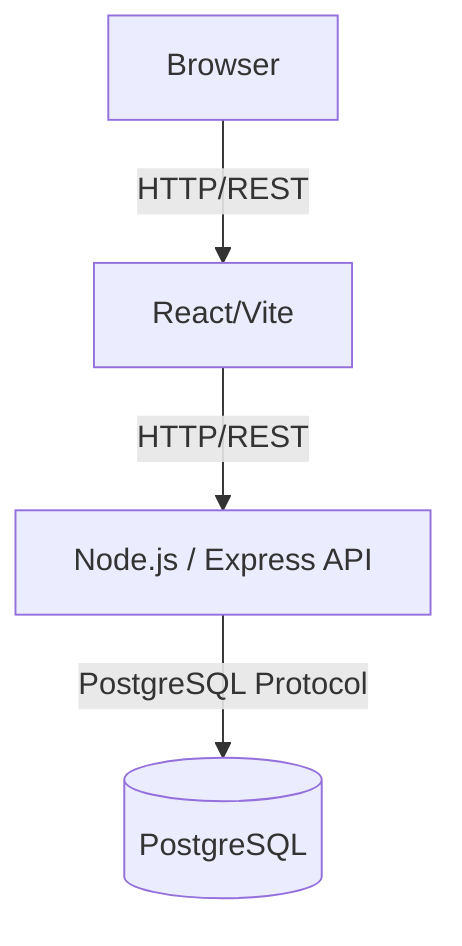
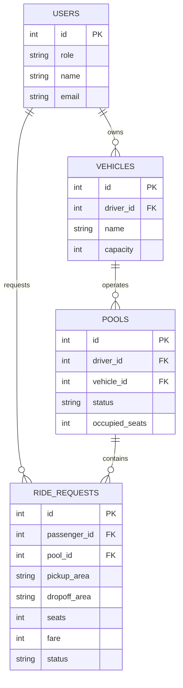

# Dhaka Tesla Pool

Share a seat. Split the fare. Survive Dhaka traffic.

## Summary & Problem Statement
In Dhaka's bustling traffic, passengers often travel along overlapping routes, while "Tesla" drivers (like Jashim with his 3-seat Bullet) have empty seats. The product problem is efficiently pooling these rides. Passengers (like Nusrat, Rafiq, and Shirin) need to request rides, share seats if routes overlap, see their own estimated fares, and track ride status independently. Drivers need to see assigned passengers, enforce seat capacity, and manage the trip lifecycle.

## Features Implemented
- **Passenger Flow**: Sign up/in, request ride (pickup, destination, seats), see estimated fare, track ride status, view history.
- **Driver Flow**: Sign in, go online, view pending requests, accept rides/pools, update ride status (arrive, start, complete).
- **Seat Capacity Enforcement**: Multiple requests can share a vehicle, but occupied seats strictly never exceed capacity.
- **Fare Model**: Individual fares calculated automatically factoring in a pool discount.
- **Concurrency**: Handled properly at the database level to prevent overbooking seats.

## Architecture



## Database Diagram (ERD)



## Tech Stack & Choices
- **Frontend**: React 18 + Vite (Clean, fast, and simple for MVP).
- **Backend**: Node.js + Express (Lightweight, well-supported, perfect for building robust REST APIs quickly).
- **Database**: PostgreSQL (Chosen for strong relational integrity, transactions, and row-level locking needed for the concurrency problem).
- **Tooling**: Knex.js (Query builder for simple migrations and type-safe DB queries without overhead of a heavy ORM), Docker (for reproducible environments).

## Project Structure
```
.
├── api/            # Express backend
├── web/            # React frontend
├── database/       # Migrations and seed data
├── docker-compose.yml
└── README.md
```

## Prerequisites
- Docker and Docker Compose
- Node.js (if running locally without Docker)

## Environment Variables
See `.env.example` in the root directory. Key variables include `DATABASE_URL` and `PORT`.

## Local Setup & Docker Instructions
To start the entire application (DB, API, Frontend):
```bash
docker compose up --build
```
This will automatically run database migrations and insert the seed data (Jashim, Nusrat, Rafiq, Shirin).

**Access URLs**:
- Frontend: `http://localhost:5173`
- Backend API: `http://localhost:3000`

## Demo Credentials
Use the following seed data to test the flows:
- **Driver**: Jashim (`jashim@example.com` / `password123`) - Drives "Bullet" (3 seats)
- **Passengers**:
  - Nusrat (`nusrat@example.com` / `password123`)
  - Rafiq (`rafiq@example.com` / `password123`)
  - Shirin (`shirin@example.com` / `password123`)

## API Overview
- `POST /api/auth/login`
- `GET /api/rides` - List available rides
- `POST /api/rides/request` - Passenger requests ride
- `POST /api/pools/join` - Driver accepts a ride request into a pool
- `PUT /api/pools/:id/status` - Update trip state (STARTED, COMPLETED)

## Concurrency Problem
**How it's handled now**: Seat booking concurrency is managed via PostgreSQL's row-level locking (`SELECT ... FOR UPDATE`) inside a transaction when joining a pool, paired with a database constraint (`pools_occupied_seats_check`). If Nusrat and Shirin try to grab the last seat simultaneously, the database ensures they are processed sequentially, and the second transaction will safely fail the capacity check.

## Key Decisions & Known Limitations
- **Fare Model**: All money is stored as integer *paisa* (1 BDT = 100 paisa) to avoid floating-point precision errors. `passengerFare = baseFare + distanceCharge - poolDiscount`.
- **Matching Rule**: For simplicity, matching is currently done logically by overlapping zones rather than complex geo-spatial routing.
- **Limitation**: Currently uses a predefined list of areas rather than a real map.

## Next Improvements
- Add WebSocket support for real-time ride tracking updates.
- Implement more granular location data and map integration.
- Implement actual payment gateway integration.

## AI Usage
- **Tools Used**: Cursor, Copilot.
- **Purpose**: Rapid scaffolding of React components, writing boilerplate for Express routes.
- **Accepted Suggestion**: Using row-level locking for the concurrency seat problem.
- **Rejected Suggestion**: Implementing Redis and microservices for ride matching. We opted for PostgreSQL and a simple monolithic backend to keep the MVP focused and avoid unnecessary complexity.

## Demo Video & Deployment
- **Deployment URL**: (Pending deployment)
- **Demo Video**: [Link to 6-minute Loom Video]
