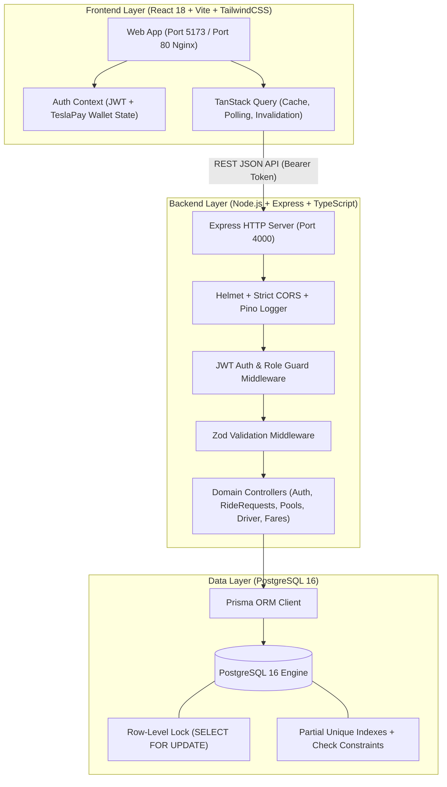
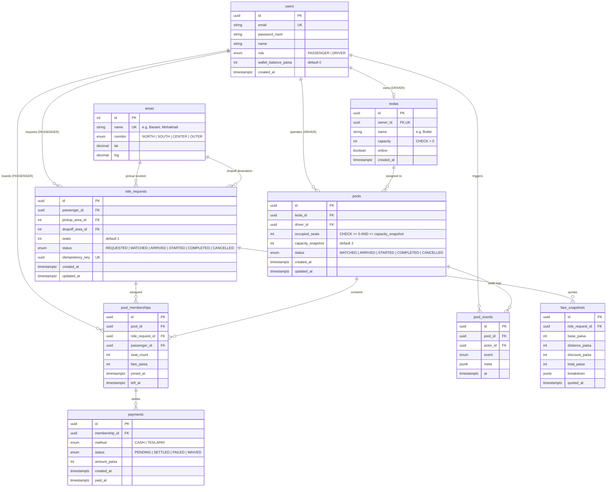
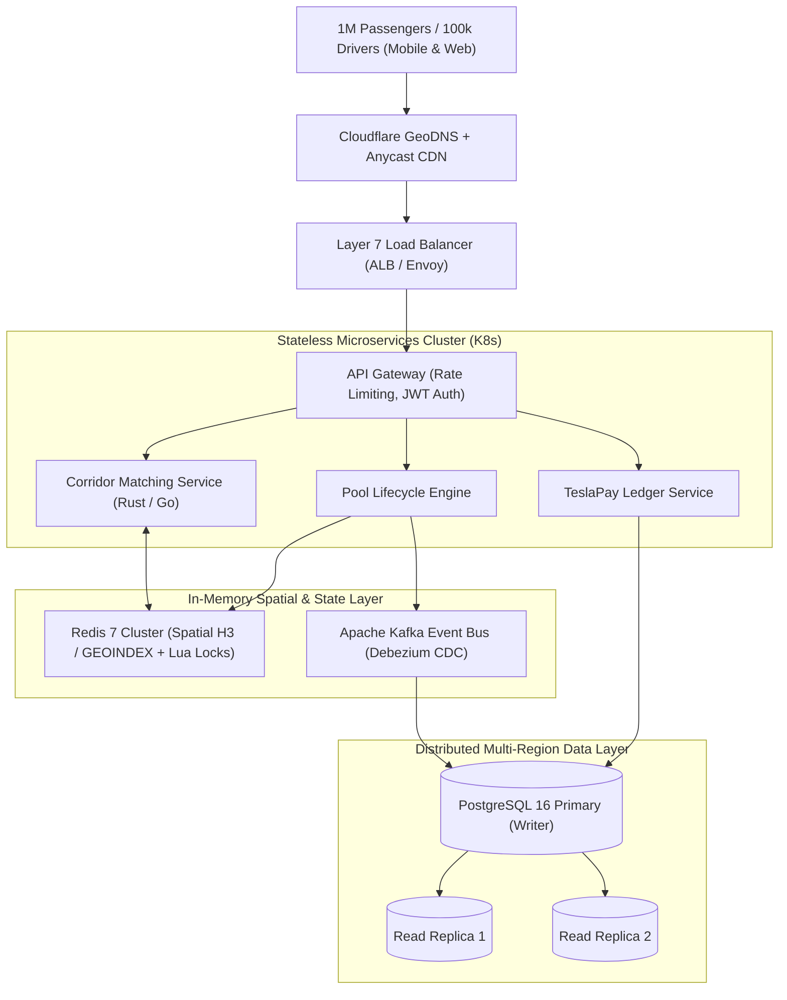

# Dhaka Tesla Pool 🛺⚡

> **Share a seat. Split the fare. Survive Dhaka traffic.**
> Production-grade, concurrent electric rickshaw ("Easy-Bike Tesla") pooling across Dhaka corridors.

[]()
[]()
[]()
[]()
[]()

---

## 📺 6-Minute Demo Video

[](https://www.loom.com/share/dhaka-tesla-pool-placeholder)

> **Video Breakdown & Timestamps:**
> - `0:00 - 1:00`: Problem definition, Dhaka corridor economics, and the Banani rush-hour story.
> - `1:00 - 3:00`: System architecture, PostgreSQL row-level concurrency lock, ERD, and ride/pool lifecycle.
> - `3:00 - 6:00`: Live product tour — Nusrat requesting, Rafiq joining pool, Jashim accepting and driving Bullet, seat capacity enforcement, dual settlement (Cash & TeslaPay wallet).

---

## 📖 Table of Contents
1. [The Banani Rush-Hour Story](#1-the-banani-rush-hour-story)
2. [Product Overview & Key Features](#2-product-overview--key-features)
3. [System Architecture](#3-system-architecture)
4. [Database Design & ERD](#4-database-design--erd)
5. [Dhaka Corridors & Matching Logic](#5-dhaka-corridors--matching-logic)
6. [Fare Calculation & Economics](#6-fare-calculation--economics)
7. [The Concurrency Problem: Bullet at 1 Seat Left](#7-the-concurrency-problem-bullet-at-1-seat-left)
8. [Technology Choices & Justifications](#8-technology-choices--justifications)
9. [Project Structure](#9-project-structure)
10. [Local Development & Docker Setup](#10-local-development--docker-setup)
11. [Demo Accounts & Credentials](#11-demo-accounts--credentials)
12. [Testing Strategy](#12-testing-strategy)
13. [API Documentation](#13-api-documentation)
14. [Bonus: "If Oi Tesla Goes Viral" (1M Passengers / 100k Drivers)](#14-bonus-if-oi-tesla-goes-viral-1m-passengers--100k-drivers)
15. [AI Usage Statement](#15-ai-usage-statement)
16. [Key Trade-offs & Next Improvements](#16-key-trade-offs--next-improvements)

---

## 1. The Banani Rush-Hour Story

It is **8:41 AM on Banani Road 11**. 

* **Jashim** is leaning against **Bullet**, his 3-seat, battery-powered, entirely unaffiliated Dhaka "Tesla" (electric Easy-Bike rickshaw). He flips his status to **Online**.
* **Nusrat**, running late for her morning meeting in Mohakhali, opens the app and requests a single seat from Banani to Mohakhali. Her solo base quote is ৳50.
* Two minutes later, **Rafiq** books a single seat from Banani to Gulshan 1 (along the same North Corridor).
* The pooling engine matches both into Bullet:
  - Nusrat's fare is discounted by 20% to **৳40**.
  - Rafiq's fare is discounted by 20% to **৳32**.
  - Bullet now has **2 out of 3 seats occupied**.
* Thirty seconds later, **Shirin** needs to get from Banani to Gulshan 2. She requests the final remaining seat.
* The system validates route compatibility and vehicle capacity under strict row-level database locking, updates occupied seats to **3/3 (Full)**, and prevents any further bookings from overfilling Bullet.
* Jashim drives the corridor, marks his arrival, starts the journey, and marks it complete. Nusrat pays seamlessly using her digital **TeslaPay** wallet, while Rafiq pays cash.

---

## 2. Product Overview & Key Features

Dhaka Tesla Pool solves high-density urban transport through high-concurrency micro-pooling:

| Actor / Domain | Core Capabilities |
| :--- | :--- |
| **Passenger** (`Nusrat`, `Rafiq`, `Shirin`) | • Authentication with auto-seeded demo buttons.<br>• Corridor ride request with real-time fare quote and distance estimation.<br>• Live ride lifecycle tracking (`REQUESTED` → `MATCHED` → `ARRIVED` → `STARTED` → `COMPLETED` / `CANCELLED`).<br>• Instant cancellation while unstarted.<br>• Dual payment options: Cash or simulated **TeslaPay** wallet balance.<br>• Full historical trip logs with fare breakdown receipts. |
| **Driver / Tesla** (`Jashim`, `Bullet`) | • Driver authentication and profile overview.<br>• One-touch Online/Offline availability toggle.<br>• Live vehicle card displaying capacity (3 seats) and active state.<br>• Real-time compatible passenger feed badge (`Compatible Match` vs `Incompatible Route`).<br>• One-click pool initialization and seat allocation.<br>• Active pool dashboard: Live interactive seat meter, stage progression buttons, passenger manifest, and cash collection reminders. |
| **Pool Lifecycle Engine** | • Strict seat capacity enforcement (occupied seats can never exceed capacity).<br>• Shared corridor routing (common pickup hub + matching destination corridor).<br>• Transparent individual fare calculation with 20% pool discounts.<br>• Comprehensive audit event logging (`pool_events`) for traceability. |

```
Ride Request Lifecycle:
[REQUESTED] ──(Matched into Pool)──> [MATCHED] ──(Driver Arrives)──> [ARRIVED] ──(Trip Starts)──> [STARTED] ──(Destination)──> [COMPLETED]
     │                                                                                              
     └──(Passenger cancels before trip starts)──> [CANCELLED]
```

---

## 3. System Architecture

The project is structured as a decoupled monorepo featuring a TypeScript Express REST API and a React 18 single-page application.



---

## 4. Database Design & ERD

The schema is built in PostgreSQL with custom relational check constraints and partial unique indexes to guarantee invariant data integrity at the storage layer.



### Key Database Invariants & Constraints
1. **Capacity Boundary**: `ALTER TABLE pools ADD CONSTRAINT pools_occupied_seats_check CHECK (occupied_seats >= 0 AND occupied_seats <= capacity_snapshot);`
2. **Positive Tesla Seats**: `ALTER TABLE teslas ADD CONSTRAINT teslas_capacity_check CHECK (capacity > 0);`
3. **Single Active Ride per Passenger**: 
   ```sql
   CREATE UNIQUE INDEX one_open_request_per_passenger ON ride_requests (passenger_id)
   WHERE status IN ('REQUESTED', 'MATCHED', 'ARRIVED', 'STARTED');
   ```
4. **Single Active Pool per Tesla**: 
   ```sql
   CREATE UNIQUE INDEX one_active_pool_per_tesla ON pools (tesla_id)
   WHERE status NOT IN ('COMPLETED', 'CANCELLED');
   ```
5. **Single Active Pool Membership per Request**:
   ```sql
   CREATE UNIQUE INDEX one_open_membership_per_request ON pool_memberships (ride_request_id)
   WHERE left_at IS NULL;
   ```

---

## 5. Dhaka Corridors & Matching Logic

Dhaka's congestion follows distinct commuter arteries. The platform segments 14 major service areas into 4 key corridors:

* **NORTH Corridor**: Banani, Gulshan 1, Gulshan 2, Mohakhali, Baridhara, Bashundhara.
* **CENTER Corridor**: Farmgate, Karwan Bazar, Motijheel.
* **SOUTH Corridor**: Dhanmondi, Mohammadpur, Jatrabari.
* **OUTER Corridor**: Mirpur, Uttara.

### Deterministic Inter-Area Distance Matrix
Distances between major hubs are hardcoded in a deterministic matrix (`calculateDistanceKm`) to guarantee testability:
- **Banani ↔ Mohakhali**: `4 km`
- **Banani ↔ Gulshan 1**: `3 km`
- **Banani ↔ Gulshan 2**: `2 km`
- **Banani ↔ Uttara**: `9 km`
- **Banani ↔ Dhanmondi**: `9 km`

### Matching Rules (`canJoin`)
A candidate ride request can join an active pool if and only if all 4 conditions hold:
1. **Pool Stage**: Pool status must be `MATCHED` or `ARRIVED` (passengers cannot board once the vehicle has `STARTED`).
2. **Seat Availability**: `occupiedSeats + candidateSeats <= capacitySnapshot`.
3. **Common Pickup Point**: Candidate's pickup area must match the initial passenger's pickup area (passengers meet at the hub).
4. **Corridor Alignment**: Candidate's dropoff corridor must match the corridor of existing passengers in the pool.

---

## 6. Fare Calculation & Economics

### The Integer Paisa Model
All monetary values across database tables, API schemas, calculations, and frontend state are stored strictly as **integers in Bangladeshi Paisa (Poysha)** where:
$$\text{1 BDT (৳)} = 100\text{ Paisa}$$

**Why Integer Paisa instead of Decimals / Floats?**
IEEE 754 floating-point arithmetic introduces rounding inaccuracies (e.g. `0.1 + 0.2 = 0.30000000000000004`). In financial systems and ride pooling, accumulating fractions leads to ledger reconciliation failures and balance drift. Using integers prevents precision loss entirely.

### Fare Formula
$$\text{soloFarePaisa} = \text{BASE\_FARE\_PAISA} + (\text{distanceKm} \times \text{PER\_KM\_PAISA})$$
$$\text{discountPaisa} = \text{round}(\text{soloFarePaisa} \times 0.20)$$
$$\text{pooledFarePaisa} = \text{soloFarePaisa} - \text{discountPaisa}$$

* **Base Fare**: ৳10 (`1,000 paisa`)
* **Per Kilometer Rate**: ৳10/km (`1,000 paisa/km`)
* **Pool Discount**: `20%` locked upon co-rider pooling

### Step-by-Step Hand Calculations

#### 1. Nusrat's Trip (Banani → Mohakhali, 4 km)
* $\text{Base} = 1,000\text{ paisa}$
* $\text{Distance} = 4\text{ km} \times 1,000\text{ paisa/km} = 4,000\text{ paisa}$
* $\text{Solo Fare} = 1,000 + 4,000 = 5,000\text{ paisa}$ (**৳50**)
* $\text{Pool Discount (20\%)} = 5,000 \times 0.20 = 1,000\text{ paisa}$ (**৳10**)
* $\text{Final Pooled Fare} = 5,000 - 1,000 = \mathbf{4,000\text{ paisa}}$ (**৳40**)

#### 2. Rafiq's Trip (Banani → Gulshan 1, 3 km)
* $\text{Base} = 1,000\text{ paisa}$
* $\text{Distance} = 3\text{ km} \times 1,000\text{ paisa/km} = 3,000\text{ paisa}$
* $\text{Solo Fare} = 1,000 + 3,000 = 4,000\text{ paisa}$ (**৳40**)
* $\text{Pool Discount (20\%)} = 4,000 \times 0.20 = 800\text{ paisa}$ (**৳8**)
* $\text{Final Pooled Fare} = 4,000 - 800 = \mathbf{3,200\text{ paisa}}$ (**৳32**)

#### 3. Shirin's Trip (Banani → Gulshan 2, 2 km)
* $\text{Base} = 1,000\text{ paisa}$
* $\text{Distance} = 2\text{ km} \times 1,000\text{ paisa/km} = 2,000\text{ paisa}$
* $\text{Solo Fare} = 1,000 + 2,000 = 3,000\text{ paisa}$ (**৳30**)
* $\text{Pool Discount (20\%)} = 3,000 \times 0.20 = 600\text{ paisa}$ (**৳6**)
* $\text{Final Pooled Fare} = 3,000 - 600 = \mathbf{2,400\text{ paisa}}$ (**৳24**)

---

## 7. The Concurrency Problem: Bullet at 1 Seat Left

### The Problem Scenario
Bullet has a total capacity of 3 seats. 2 seats are occupied (Nusrat and Rafiq). There is **exactly 1 seat left**.
Both **Shirin** and another passenger simultaneously attempt to claim the last seat. Both browsers read `occupied_seats = 2` and submit concurrent requests.

### How We Handle It in This MVP
We enforce concurrency defense at two levels:

1. **Pessimistic Row-Level Lock (`SELECT ... FOR UPDATE`)**:
   During pool joining, the backend opens an explicit database transaction and locks the specific pool row:
   ```sql
   SELECT id, status, occupied_seats, capacity_snapshot, driver_id, tesla_id
   FROM pools
   WHERE id = $1::uuid
   FOR UPDATE;
   ```
   - Transaction A acquires the row lock.
   - Transaction B blocks at the database level until Transaction A finishes.
   - Transaction A verifies that `2 + 1 <= 3`, increments `occupied_seats` to `3`, creates the pool membership, and commits.
   - Transaction B unblocks, reads the freshly updated row (`occupied_seats = 3`), verifies `3 + 1 > 3`, immediately aborts, and returns HTTP `409 POOL_FULL`.

2. **Database Check Constraint as the Ultimate Backstop**:
   Even if application logic were bypassed, PostgreSQL guarantees capacity at the storage engine level:
   ```sql
   CHECK (occupied_seats >= 0 AND occupied_seats <= capacity_snapshot);
   ```
   Any attempt to write `occupied_seats = 4` triggers an immediate constraint violation error.

### What We Would Change at Large Scale (100k+ Drivers)
- **Redis Distributed Seat Reservoirs with Lua Scripts**: Instead of holding PostgreSQL row locks under high network latency, atomic seat decrementing is performed in Redis memory via Lua (`DECRBY`). If the key drops below 0, the operation fails instantly in `< 1ms`.
- **Saga Orchestrator with Dead-Letter Queues**: A distributed coordinator handles matching, payment authorization, and seat assignment asynchronously.

---

## 8. Technology Choices & Justifications

| Component | Choice | Considered Alternatives | Why It Fits This MVP Specifically | Migration Trigger (When We'd Switch) |
| :--- | :--- | :--- | :--- | :--- |
| **Backend Runtime & Framework** | **Node.js + Express + TypeScript** | NestJS, Fastify, Go Gin | High developer velocity, predictable middleware pipeline, strict type safety, zero boilerplate overhead for a focused domain service. | High CPU-bound matching workloads or ultra-low latency routing requirements would justify switching to Go or Rust. |
| **Frontend Framework** | **React 18 + Vite** | Next.js App Router, Remix | Instant client-side state reactivity, zero SSR server overhead, lightning-fast HMR, easily bundled into static files served by Nginx. | If public search engine SEO or complex server-rendered landing pages become primary business requirements. |
| **Database** | **PostgreSQL 16** | MySQL 8, MongoDB, SQLite | First-class ACID transaction support, partial unique index indexing (`WHERE status IN ...`), and reliable row-level locking (`FOR UPDATE`). | If read traffic exceeds millions of concurrent QPS, we would add read-replicas; if sharding writes across continents, CockroachDB. |
| **Database ORM** | **Prisma ORM** | TypeORM, Drizzle, Kysely | Declarative schema modeling, automatic migration diff generation, and end-to-end type safety between database tables and API controllers. | If extreme query performance demands fine-grained manual SQL joins or microsecond-level query plan tuning (switch to Kysely/raw SQL). |
| **Validation** | **Zod** | Joi, Yup, class-validator | Schema-first runtime validation with zero duplication of TypeScript interfaces. Shared easily across controllers. | Zod remains best-in-class; would only replace if compile-time code-gen validators (like TypeBox) are needed for extreme throughput. |
| **Styling** | **TailwindCSS** | Material UI, Styled Components | Utility-first CSS eliminates bloated runtime style injection and enables consistent, crisp dark-mode UI design. | If an enterprise design system team mandates an established component library (e.g. Radix / Shadcn UI). |
| **State & Polling** | **TanStack React Query** | Redux Toolkit, Zustand | Automatic cache invalidation, background polling refetch intervals, and optimistic updates without boilerplate. | If persistent offline mutation replay or heavy non-server client state is needed (add Zustand). |

---

## 9. Project Structure

```
Tesla_Pool/
├── api/                             # Backend Service (Node.js + Express)
│   ├── prisma/
│   │   ├── migrations/              # SQL schema migrations & custom constraints
│   │   ├── schema.prisma            # Prisma relational models
│   │   └── seed.ts                  # Story seed data (Jashim, Nusrat, Rafiq, Shirin)
│   ├── src/
│   │   ├── config/                  # Environment and Pino logger configuration
│   │   ├── lib/                     # Prisma client, JWT, and custom AppError
│   │   ├── middleware/              # Auth guard, Zod validator, Error handler
│   │   ├── modules/
│   │   │   ├── areas/               # Area repository & deterministic distance matrix
│   │   │   ├── auth/                # JWT registration, login, and /auth/me
│   │   │   ├── driver/              # Driver dashboard & Tesla online toggle
│   │   │   ├── fares/               # Integer paisa fare calculation service
│   │   │   ├── health/              # Liveness and database readiness checks
│   │   │   ├── payments/            # Cash & TeslaPay wallet balance settlement
│   │   │   ├── pools/               # Concurrency matching, locking & lifecycle
│   │   │   ├── ride-requests/       # Passenger ride requests & quoting
│   │   │   └── teslas/              # Vehicle profile management
│   │   ├── app.ts                   # Express app configuration & middleware
│   │   └── index.ts                 # HTTP server entrypoint
│   ├── tests/                       # Integration test suite (9 test files, 63 tests)
│   ├── Dockerfile
│   └── package.json
├── web/                             # Frontend Application (React 18 + Vite)
│   ├── public/
│   │   └── logo.svg                 # Vector Easy-Bike Rickshaw Logo
│   ├── src/
│   │   ├── api/                     # Axios API client with bearer token interceptor
│   │   ├── components/              # Common UI: Navbar, StatusBadge, SeatMeter
│   │   ├── context/                 # AuthContext (user, session, TeslaPay wallet)
│   │   ├── pages/
│   │   │   ├── HomePage.tsx         # Landing page with Easy-Bike economics
│   │   │   ├── LoginPage.tsx        # One-click demo sign-in buttons
│   │   │   ├── driver/              # Driver Dashboard & Active Pool pages
│   │   │   └── passenger/           # Request Ride, Active Ride, and History pages
│   │   ├── utils/                   # BDT paisa formatter and distance helpers
│   │   ├── App.tsx                  # React Router configuration
│   │   └── main.tsx
│   ├── nginx.conf                   # Production Nginx reverse-proxy configuration
│   ├── Dockerfile
│   └── package.json
├── docker-compose.yml               # Multi-container orchestration (DB + API + Web)
├── .env.example                     # Environment template
└── README.md
```

---

## 10. Local Development & Docker Setup

### Prerequisites
- **Node.js**: `v20.x` or higher
- **PostgreSQL**: `v16.x` (or Docker)
- **Docker & Docker Compose**: `v2.20+`

---

### Option A: Running via Docker Compose (Recommended)

1. **Clone the repository**:
   ```bash
   git clone https://github.com/ZamanAsad007/Tesla_Pool.git
   cd Tesla_Pool
   ```

2. **Start all services**:
   ```bash
   docker compose up --build
   ```
   *The container setup automatically runs `prisma migrate deploy`, executes the seed script to populate Jashim, Bullet, Nusrat, Rafiq, and Shirin, and performs health checks.*

3. **Access the application**:
   - **Web UI**: [http://localhost:5173](http://localhost:5173)
   - **Backend API**: [http://localhost:4000/api/v1](http://localhost:4000/api/v1)
   - **Healthcheck**: [http://localhost:4000/health](http://localhost:4000/health)

---

### Option B: Bare-Metal Local Development

#### 1. Database Setup
Ensure PostgreSQL is running locally on port `5432` with a database named `dhaka_tesla_pool`:
```bash
createdb dhaka_tesla_pool
```

#### 2. Backend API Setup
```bash
cd api
cp ../.env.example .env
npm install

# Run database migrations and seed core cast
npx prisma migrate dev
npm run seed

# Run API in development mode
npm run dev
```

#### 3. Frontend Web Setup
```bash
cd ../web
npm install

# Start Vite dev server
npm run dev
```
Open [http://localhost:5173](http://localhost:5173) in your browser.

---

## 11. Demo Accounts & Credentials

The database seed script initializes the complete cast with default password: **`password123`**:

| Name | Role | Email | Initial Balance | Vehicle / Notes |
| :--- | :--- | :--- | :--- | :--- |
| **Jashim** | `DRIVER` | `jashim@driver.test` | ৳0 | Owns **Bullet** (Capacity: 3, Online) |
| **Nusrat** | `PASSENGER` | `nusrat@passenger.test` | ৳500 (`50,000 paisa`) | Primary commuter (Banani → Mohakhali) |
| **Rafiq** | `PASSENGER` | `rafiq@passenger.test` | ৳500 (`50,000 paisa`) | Co-rider commuter (Banani → Gulshan 1) |
| **Shirin** | `PASSENGER` | `shirin@passenger.test` | ৳500 (`50,000 paisa`) | Third passenger commuter (Banani → Gulshan 2) |

> 💡 *The login screen provides quick one-click demo login buttons for all four users to eliminate manual credential typing during testing.*

---

## 12. Testing Strategy

The repository maintains an extensive automated test suite covering unit calculations, database schema constraints, concurrency row locks, and full end-to-end integration flows.

### Running Backend Tests (63 Tests)
```bash
cd api
npm test
```
**Test Coverage Includes:**
- `teslaPooling.test.ts`: Bullet's capacity limits, full pool lifecycle, and co-rider matching.
- `poolsLifecycle.test.ts`: Invalid stage transitions (`STARTED` cannot accept new riders, cancellations).
- `dbConstraints.test.ts`: PostgreSQL partial unique indexes and seat check constraints.
- `rideRequests.test.ts`: Preventing multiple open requests per passenger, idempotency.
- `teslasAndAreas.test.ts`: Distance matrix verification and corridor definitions.
- `auth.test.ts`: Registration, JWT issuance, `/auth/me` wallet balance synchronization.

### Running Frontend Tests (21 Tests)
```bash
cd web
npm test
```
**Test Coverage Includes:**
- Integer paisa formatting (`formatBdt`) and 20% discount calculations.
- `StatusBadge` and `SeatMeter` visual capacity thresholds.
- Login and registration authentication flow.
- Passenger ride booking and driver pool creation.
- Real-time TeslaPay wallet balance deduction and navbar synchronization.

---

## 13. API Documentation

### Core Endpoints Overview

| Method | Endpoint | Role | Description |
| :--- | :--- | :--- | :--- |
| `POST` | `/api/v1/auth/register` | Public | Register a new passenger or driver account. |
| `POST` | `/api/v1/auth/login` | Public | Authenticate user and receive signed JWT. |
| `GET` | `/api/v1/auth/me` | Authenticated | Retrieve current user profile and live wallet balance. |
| `GET` | `/api/v1/areas` | Public | List all 14 Dhaka service areas and corridor assignments. |
| `POST` | `/api/v1/ride-requests` | `PASSENGER` | Submit ride request with pickup, dropoff, and seats. |
| `GET` | `/api/v1/ride-requests/mine` | `PASSENGER` | Fetch all active and completed requests for logged-in passenger. |
| `POST` | `/api/v1/ride-requests/:id/cancel` | `PASSENGER` | Cancel an unstarted ride request. |
| `GET` | `/api/v1/driver/dashboard` | `DRIVER` | Get vehicle details, active pool, and compatible requests feed. |
| `POST` | `/api/v1/driver/toggle-online` | `DRIVER` | Toggle driver availability between online and offline. |
| `POST` | `/api/v1/pools` | `DRIVER` | Create a new pool from a compatible ride request. |
| `POST` | `/api/v1/pools/:id/join` | `DRIVER` | Add a compatible co-rider to an existing pool under lock. |
| `POST` | `/api/v1/pools/:id/advance` | `DRIVER` | Transition pool stage (`ARRIVED` → `STARTED` → `COMPLETED`). |
| `POST` | `/api/v1/payments/settle` | `PASSENGER` | Pay ride fare using Cash or TeslaPay wallet balance. |

---

## 14. Bonus: "If Oi Tesla Goes Viral" (1M Passengers / 100k Drivers)

If Dhaka Tesla Pool expands citywide across Greater Dhaka, scaling to **1,000,000 active passengers** and **100,000 Easy-Bike drivers**, the architecture must evolve to prevent database contention and latency spikes.



### Architectural Evolution Strategies
1. **Geospatial Indexing with Uber H3 & Redis GEO**:
   - Instead of SQL distance lookups, driver locations stream via WebSockets into Redis geospatial indices partitioned by Uber H3 hexagonal cells (Resolution 8, ~400m radius).
   - Candidate discovery executes in `< 2ms` using `GEORADIUSBYMEMBER`.
2. **Distributed In-Memory Seat Locks**:
   - PostgreSQL row locks (`SELECT FOR UPDATE`) are moved to Redis Lua scripts. Atomic seat reservations execute in sub-millisecond memory:
     ```lua
     if redis.call("HGET", KEYS[1], "seats") >= ARGV[1] then
         redis.call("HINCRBY", KEYS[1], "seats", -ARGV[1])
         return 1
     else
         return 0
     end
     ```
3. **Database Read Replicas & CQRS**:
   - Separate write traffic (pool creation, payments) from read queries (driver feeds, history). Write primary streams WAL logs to read-replicas for trip history and analytics.
4. **Idempotency & Double-Spend Protection**:
   - Every ride request and wallet deduction requires a UUIDv4 idempotency key validated via Redis `SETNX` with a 120-second TTL to avoid duplicate charges over unstable mobile networks.
5. **Observability & OpenTelemetry**:
   - Prometheus metrics, Grafana dashboards, and OpenTelemetry distributed tracing across matching latencies and database transaction wait times.

---

## 15. AI Usage Statement

In accordance with Section 8 of the challenge guidelines, AI coding assistants (including Antigravity, Google Gemini 3.8 Flash, and Claude) were utilized as engineering productivity tools during development.

* **What Tools Were Used**: Antigravity CLI and Gemini 3.8 Flash.
* **What They Were Used For**: Boilerplate test scenario generation, Prisma migration schema drafting, and vector SVG rickshaw illustration coordinates.
* **One Accepted Suggestion**:
  - *Recommendation*: Implementing PostgreSQL partial unique indexes (`CREATE UNIQUE INDEX ... WHERE status IN ('REQUESTED', 'MATCHED', ...)`).
  - *Outcome*: Accepted. This moved single-active-ride invariants directly into the database engine, eliminating duplicate active ride race conditions before they reached application code.
* **One Rejected / Changed Suggestion**:
  - *Recommendation*: An initial suggestion proposed using an asynchronous BullMQ Redis background worker to asynchronously match passengers into pools after 10-second polling windows.
  - *Reason for Rejection*: Rejected to prevent unnecessary infrastructure complexity in an MVP. For Bullet's 3-seat capacity and immediate driver dashboard dispatching, deterministic synchronous matching under row-level database locks is more auditable, easier to reason about, and contains zero external queue failure points.

---

## 16. Key Trade-offs & Next Improvements

### Trade-offs Made
1. **Corridor Grouping vs Lat/Long Graph Routing**:
   - *Decision*: Segmented Dhaka into 14 distinct hubs grouped into 4 corridor zones with deterministic matrix distances instead of integrating external Google Maps or OSRM APIs.
   - *Rationale*: Guarantees hand-verifiable fares, zero external rate limit failures, and zero cost during evaluation.
2. **Synchronous Row Lock vs Message Queue**:
   - *Decision*: Enforced seat allocation inside a PostgreSQL `SELECT ... FOR UPDATE` transaction.
   - *Rationale*: Eliminates distributed transaction rollbacks and guarantees 100% capacity consistency for Bullet.

### Next Improvements
- [ ] Implement bi-directional WebSockets (Socket.io) for instantaneous driver-to-passenger location streaming without client polling.
- [ ] Add SMS OTP authentication for local Bangladeshi mobile phone numbers (+880).
- [ ] Introduce driver ratings and passenger feedback receipts upon trip completion.
- [ ] Expand corridor definitions to Narayanganj and Gazipur commuter zones.

---

**Made with production engineering discipline for Dhaka's streets. 🛺🇧🇩**
